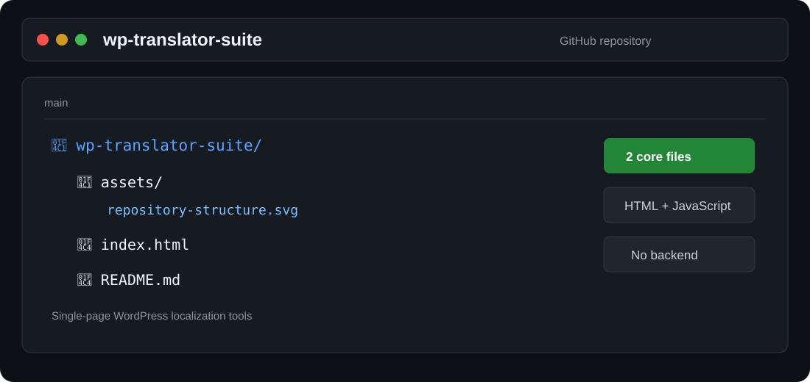

# WP-Translator-Suite


Herramienta web **single-page** para trabajar con la localización de temas y plugins de WordPress directamente desde el navegador.

Permite cargar archivos `.PO` y `.POT`, traducir cadenas, gestionar una memoria de traducción y generar archivos `.POT`, sin necesidad de instalar software ni dependencias en el servidor.



<details>
<summary>✨ Características</summary>

- 🌐 Traducción de archivos `.PO` y `.POT`.
- 🧩 Generación y extracción de archivos `.POT` para proyectos de WordPress.
- 💾 Memoria de traducción gestionada desde el navegador.
- 🔄 Intercambio rápido entre idioma de origen y destino.
- 🔍 Detección automática del idioma de origen.
- 🤖 Diferentes motores de traducción gratuitos sin API Key.
- ⏱️ Configuración del retraso entre solicitudes para reducir problemas de rate limiting.
- 📊 Resumen del archivo con cadenas totales, traducidas, pendientes y advertencias.
- 📥 Procesamiento y descarga de los archivos resultantes desde el navegador.
- 🌓 Modo claro y oscuro.
- 📱 Interfaz adaptable para escritorio y dispositivos móviles.
- 🖱️ Carga de archivos mediante selección o arrastrar y soltar.
- 🔒 Procesamiento orientado al navegador, sin backend propio.

</details>

<details>
<summary>🌍 Motores de traducción</summary>

Actualmente incluye opciones gratuitas que no requieren una API Key:

- Google Translate (Web)
- MyMemory Translate
- Lingva Translate
- Apertium

> La disponibilidad y las limitaciones de los servicios externos pueden variar con el tiempo.

</details>

<details>
<summary>📁 Estructura</summary>

```text
wp-translator-suite/
├── assets/
│   └── repository-structure.svg
├── index.html
└── README.md
```

La aplicación está contenida en `index.html`, incluyendo la interfaz, estilos y lógica necesaria para su funcionamiento.

</details>

<details>
<summary>🚀 Uso</summary>

No requiere instalación ni configuración de un servidor PHP, Node.js u otro backend.

1. Descarga o clona el repositorio.
2. Abre `index.html` en un navegador moderno.
3. Selecciona **Traductor .PO** o **Generador .POT**.
4. Carga el archivo `.PO` o `.POT` cuando corresponda.
5. Configura los idiomas y el motor de traducción.
6. Procesa y descarga el resultado desde la propia aplicación.

### 📝 Traductor .PO

Permite seleccionar el idioma de origen o detectarlo automáticamente, elegir el idioma de destino, utilizar uno de los motores disponibles y controlar el retraso entre solicitudes para reducir problemas de rate limiting.

### 🪄 Generador .POT

Permite trabajar con la generación y extracción de archivos `.POT` desde la propia aplicación, sin depender de un backend propio.

</details>

<details>
<summary>🛠️ Tecnologías</summary>

- HTML5
- JavaScript
- Tailwind CSS
- Font Awesome
- APIs/servicios de traducción externos según el motor seleccionado

</details>

<details>
<summary>⚠️ Consideraciones</summary>

WP-Translator-Suite se ejecuta principalmente en el navegador y no requiere un backend propio, pero algunas funciones dependen de servicios externos. Un cambio, límite, bloqueo o caída de uno de estos servicios puede afectar al funcionamiento del motor correspondiente.

La interfaz también utiliza recursos externos mediante CDN para determinadas librerías del proyecto.

Antes de procesar archivos importantes, se recomienda conservar una copia del archivo original.

</details>

<details>
<summary>📄 Licencia</summary>

Consulta los archivos y avisos incluidos en el repositorio para conocer las condiciones de uso del proyecto.

</details>

---

**WP-Translator-Suite** · Herramientas de localización para WordPress desde el navegador.
